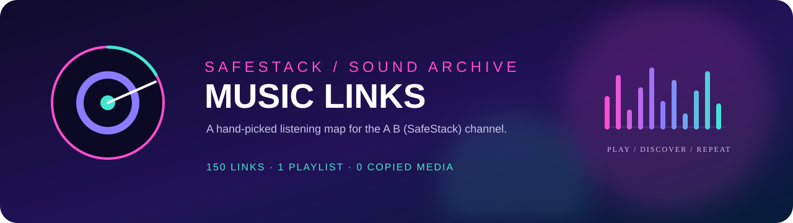

<p align="center">
  
</p>

<p align="center">
  <a href="MUSIC.md"></a>
  <a href="https://www.youtube.com/playlist?list=PLFbahqqG-AmJlT2uLLWKLiirGwqEe1H2b"></a>
  <a href="MUSIC.md"></a>
</p>

An independent listening map for the public music collection maintained on the **A B (SafeStack)** YouTube channel. This repository has its own visual language and update rhythm; it does not change or depend on other SafeStack repositories.

## Start listening

<table>
  <tr>
    <td width="33%"><strong>01 / PLAYLIST</strong><br><a href="https://www.youtube.com/playlist?list=PLFbahqqG-AmJlT2uLLWKLiirGwqEe1H2b">Open SafeStack playlist →</a></td>
    <td width="33%"><strong>02 / CHANNEL</strong><br><a href="https://www.youtube.com/@antoskegreitas3076">Open A B (SafeStack) →</a></td>
    <td width="33%"><strong>03 / CATALOGUE</strong><br><a href="MUSIC.md">Browse all 100 links →</a></td>
  </tr>
</table>

## Listening map

```text
energy  ↑       ╭─╮    ╭──╮       ╭╮
        │   ╭───╯ ╰────╯  ╰──╮ ───╯╰──╮
        │───╯                 ╰───────╯
        └──────────────────────────────→ time
             deep / melodic / progressive
```

The catalogue stores titles and canonical YouTube links only. It does not copy or redistribute audio or video files. Playback, availability, ownership, and licensing remain governed by YouTube and each individual rights holder.

## Updating the catalogue

When a public item is added to the playlist, add one row to `MUSIC.md` with its title and canonical `watch?v=` URL. Keep one row per YouTube video ID. The last collection was made on 2026-09-20.
